# EventOS 对话复习笔记

本文档整理本轮对话中围绕 EventOS Nano 框架讲过的知识点，用于后续反复复习。重点保留流程图、时序图和状态图，帮助从实例流程理解框架整体设计。

## 1. 总体心智模型

EventOS 的核心不是“函数直接调用函数”，而是：

> 应用发布事件，框架排队，调度器挑 Actor，Actor 消费事件，最后事件被回收。

最核心的四层模型：

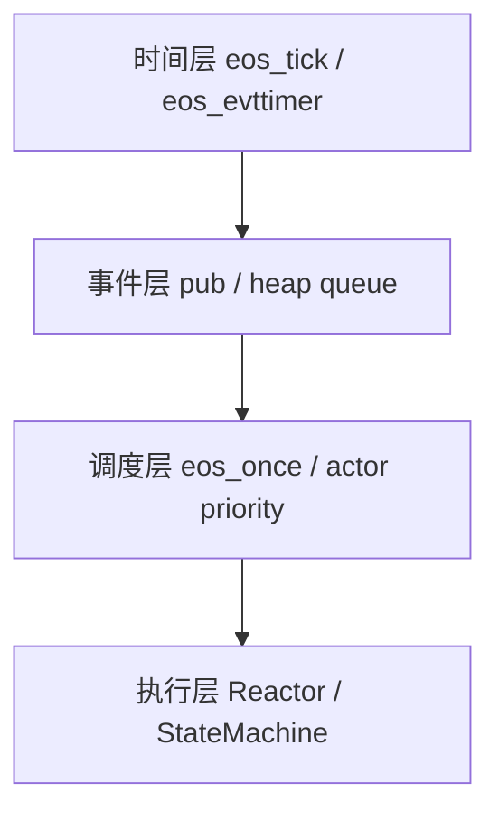

一句话版本：

> `eos_tick` 产生时间基础，`eos_evttimer` 把时间变成事件，`heap` 保存事件，`eos_once` 选择 Actor，Actor 最后以 Reactor 或状态机的方式消费事件。

## 2. 框架总流程

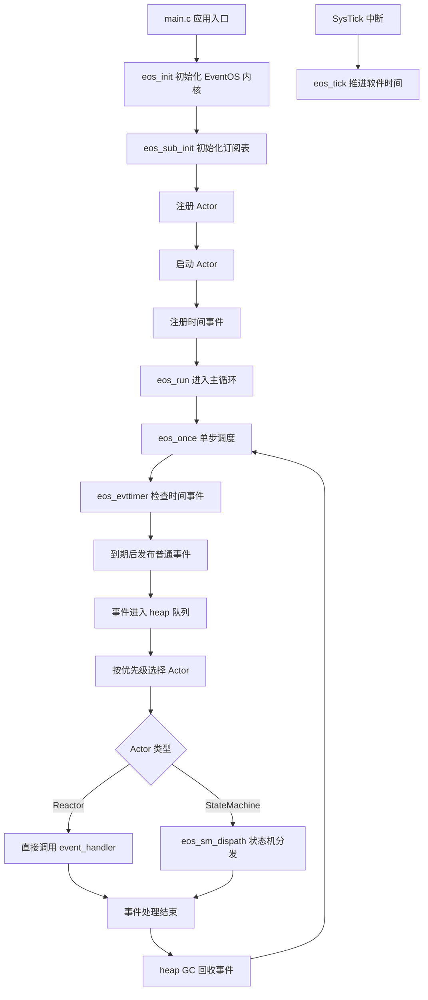

这个图要记住两点：

- `eos_tick()` 不直接处理业务，只推进软件时间。
- 时间事件到期后也会先变成普通事件，再进入统一调度链路。

## 3. STM32F103 LED 示例总流程

示例里有两类 Actor：

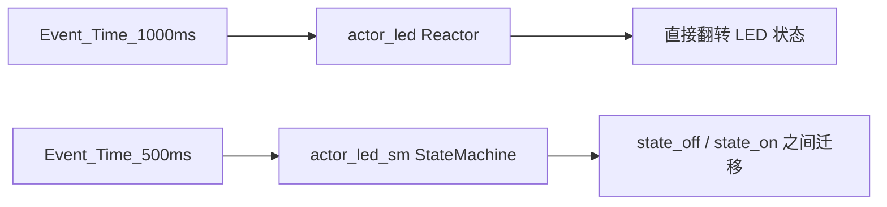

启动流程：

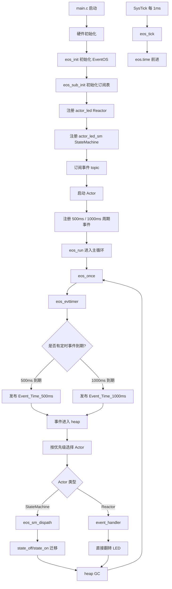

500ms 状态机线：

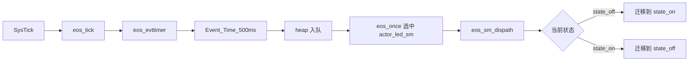

1000ms Reactor 线：

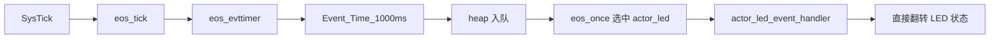

时间轴推演：

```text
0ms:
  eos_init
  注册 Actor
  启动状态机
  state_init -> state_off
  注册 500ms 周期事件
  注册 1000ms 周期事件
  eos_run 开始

500ms:
  eos_tick 已累计到 500
  eos_evttimer 发现 Event_Time_500ms 到期
  发布 Event_Time_500ms
  eos_once 选中 actor_led_sm
  state_off -> state_on

1000ms:
  500ms 周期事件再次到期
  发布 Event_Time_500ms
  1000ms 周期事件也到期
  发布 Event_Time_1000ms
  eos_once 每次只处理一个事件
  先按 Actor 优先级选择处理者
```

## 4. eos_once 单步调度

`eos_once()` 是 EventOS 里最核心的“一步调度函数”。

> 每调用一次 `eos_once()`，框架最多只处理一个 Actor 的一个事件。

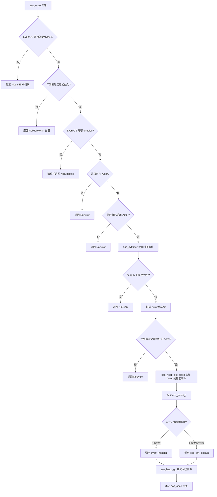

`eos_run()` 只是主循环外壳：

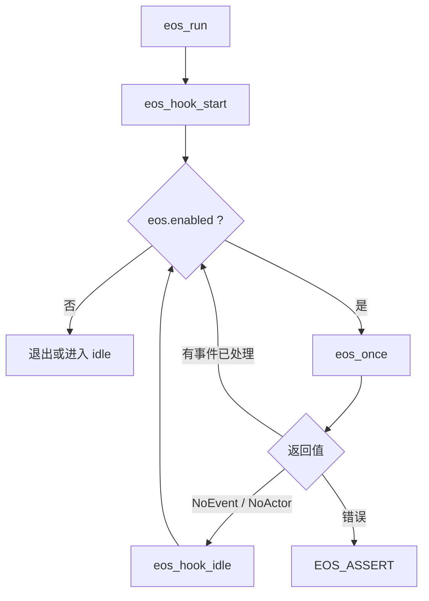

要点：

- `eos_once()` 一次只处理一个事件。
- 时间事件先在 `eos_once()` 内被转换成普通事件。
- Actor 选择由优先级、存在位图、启用位图、事件订阅位图共同决定。
- Reactor 直接回调，StateMachine 进入 `eos_sm_dispath()`。

## 5. 状态机分发 eos_sm_dispath

状态机 Actor 收到事件后进入：

```c
eos_sm_dispath(sm, event);
```

状态机总流程：

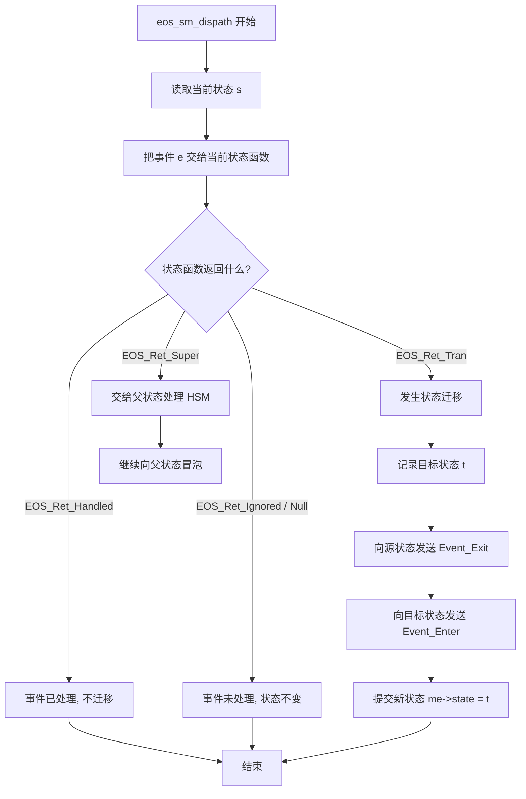

LED 示例状态图：

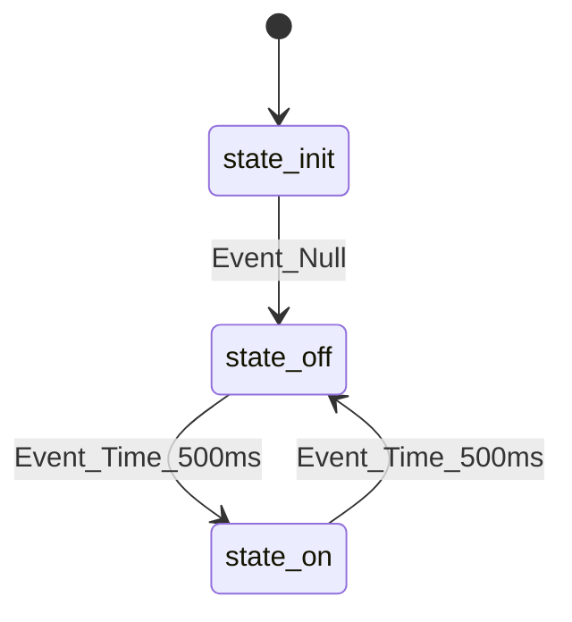

状态机启动过程：

```mermaid
sequenceDiagram
    participant App as main.c
    participant EOS as EventOS
    participant SM as actor_led_sm
    participant Init as state_init
    participant Off as state_off

    App->>EOS: eos_actor_start(actor_led_sm)
    EOS->>SM: eos_sm_start()
    SM->>Init: state_init(Event_Null)
    Init-->>SM: eos_tran(state_off)
    SM->>Off: state_off(Event_Enter)
    SM-->>EOS: 当前稳定状态 = state_off
```

第一次 500ms 事件：

```mermaid
sequenceDiagram
    participant EOS as eos_once
    participant SM as eos_sm_dispath
    participant Off as state_off
    participant On as state_on

    EOS->>SM: Event_Time_500ms
    SM->>Off: state_off(Event_Time_500ms)
    Off-->>SM: eos_tran(state_on)
    SM->>Off: state_off(Event_Exit)
    SM->>On: state_on(Event_Enter)
    SM-->>EOS: 当前状态 = state_on
```

第二次 500ms 事件：

```mermaid
sequenceDiagram
    participant EOS as eos_once
    participant SM as eos_sm_dispath
    participant On as state_on
    participant Off as state_off

    EOS->>SM: Event_Time_500ms
    SM->>On: state_on(Event_Time_500ms)
    On-->>SM: eos_tran(state_off)
    SM->>On: state_on(Event_Exit)
    SM->>Off: state_off(Event_Enter)
    SM-->>EOS: 当前状态 = state_off
```

要点：

- `eos_tran()` 只声明迁移目标，不执行 Exit/Enter。
- Exit/Enter 由 `eos_sm_dispath()` 统一补齐。
- `Event_Enter` 和 `Event_Exit` 是状态机内部保留事件，不是外部业务事件。

## 6. Heap：事件队列和事件内存池

EventOS 的 heap 不是普通业务堆，而是：

> 事件队列 + 事件内存池。

heap 总结构：

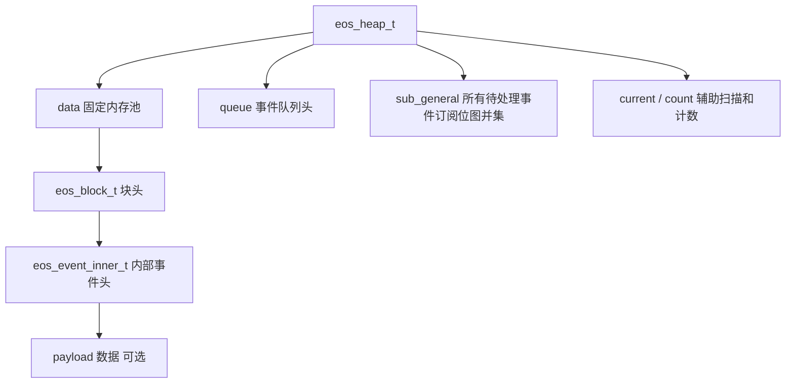

一条事件在 heap 里的布局：

```text
+----------------------+
| eos_block_t           |
+----------------------+
| eos_event_inner_t     |
|   topic               |
|   sub                 |
+----------------------+
| payload bytes         |
+----------------------+
```

发布事件时：

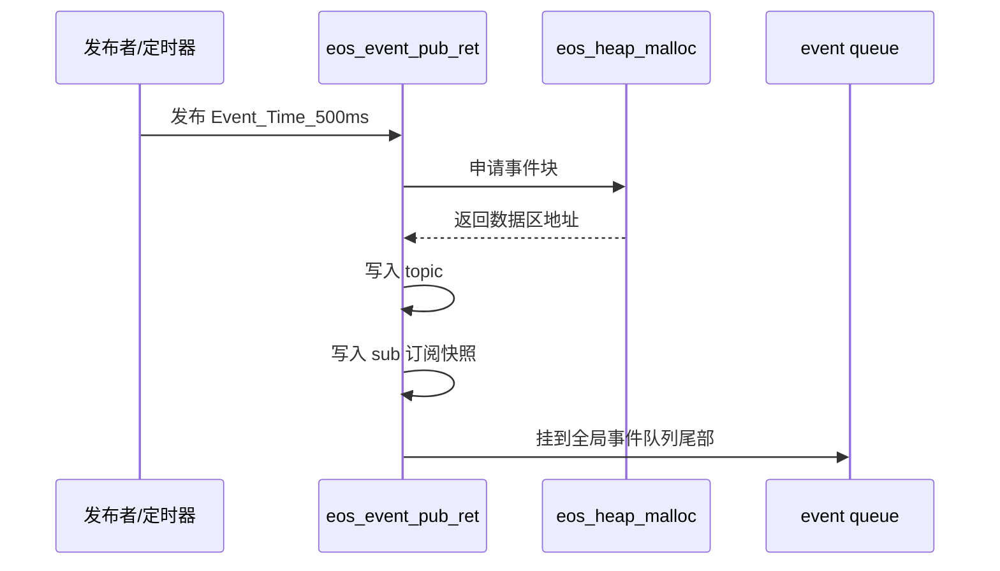

全局事件队列不是每个 Actor 一条，而是所有事件共用一条：

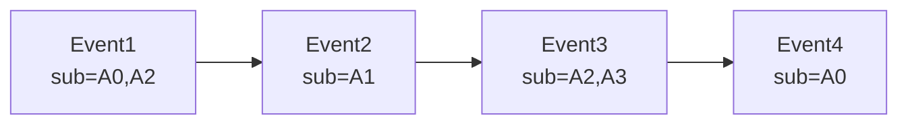

Actor 取事件：

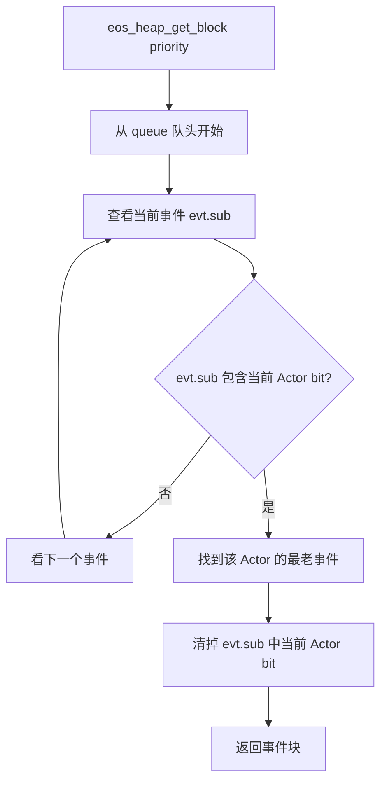

事件回收：

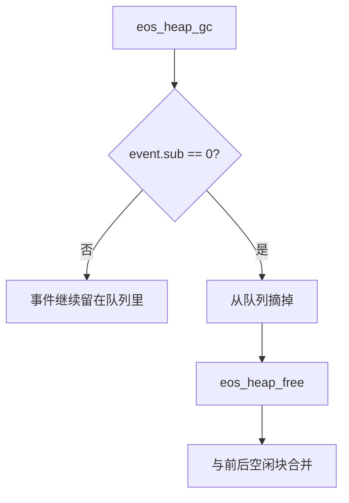

内存分配：

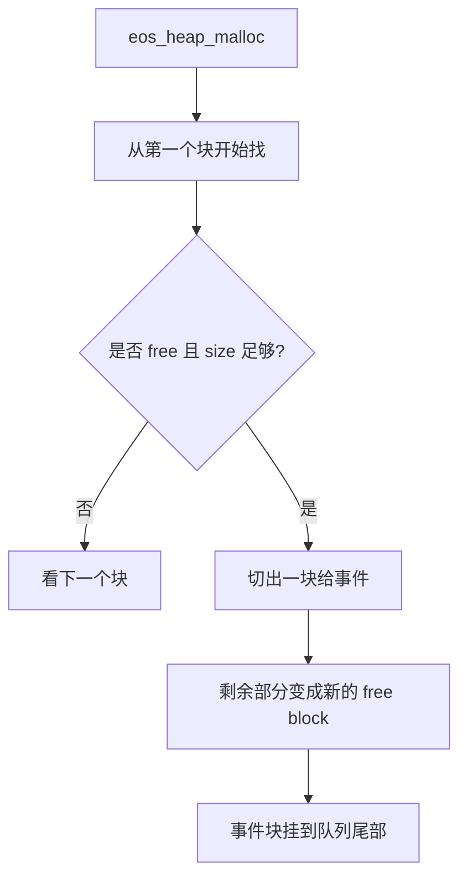

内存释放：

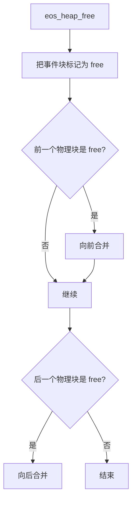

要点：

- 事件只存一份。
- 多个 Actor 共享同一条事件和 payload。
- `event.sub` 记录“还有哪些 Actor 没消费”。
- `sub == 0` 时才真正释放。

## 7. 发布订阅位图机制

这部分要记一句话：

> `sub_table` 决定“某个 topic 发布时应该给哪些 Actor”，`sub_general` 决定“当前 heap 里还有哪些 Actor 有事件待处理”，Actor 优先级则决定“调度器先服务谁”。

核心关系：

```mermaid
flowchart TD
    A[topic] --> B[sub_table topic]
    B --> C[订阅该 topic 的 Actor 位图]
    C --> D[事件发布时复制到 event.sub]
    D --> E[事件进入 heap]
    E --> F[sub_general 汇总所有 event.sub]
    F --> G[eos_once 按 Actor 优先级扫描]
    G --> H[找到有事件的 Actor]
    H --> I[eos_heap_get_block 取该 Actor 可处理的最老事件]
```

Actor priority 的双重含义：

```text
priority = 0 -> bit0 -> 0b0001
priority = 1 -> bit1 -> 0b0010
priority = 2 -> bit2 -> 0b0100
priority = 3 -> bit3 -> 0b1000
```

`sub_table` 是 topic 到 Actor 位图的映射：

```text
sub_table[Event_A] = Actor0 | Actor2 = 0b0101
sub_table[Event_B] = Actor1          = 0b0010
sub_table[Event_C] = Actor2 | Actor3 = 0b1100
```

```mermaid
flowchart LR
    A[Event_A] --> A1["sub_table[Event_A] = Actor0 | Actor2"]
    B[Event_B] --> B1["sub_table[Event_B] = Actor1"]
    C[Event_C] --> C1["sub_table[Event_C] = Actor2 | Actor3"]
```

发布事件时复制订阅快照：

```mermaid
flowchart TD
    A[eos_event_pub_topic Event_A] --> B[读取 sub_table Event_A]
    B --> C["得到 0b0101"]
    C --> D[写入 event.sub]
    D --> E[事件进入 heap]
```

`sub_general` 是所有待处理事件的总位图：

```mermaid
flowchart TD
    A["Event_A.sub = A0,A2"] --> D[sub_general]
    B["Event_B.sub = A1"] --> D
    C["Event_C.sub = A2,A3"] --> D
    D["sub_general = A0,A1,A2,A3"]
```

`eos_once()` 利用 `sub_general` 粗筛 Actor：

```mermaid
flowchart TD
    A[eos_once 扫描 Actor] --> B{actor bit 在 sub_general 中?}
    B -->|否| C[跳过这个 Actor]
    B -->|是| D[再调用 eos_heap_get_block 找具体事件]
```

总结：

- `sub_table` 是发布前的订阅关系。
- `event.sub` 是发布瞬间的订阅快照。
- `sub_general` 是当前 heap 的待处理摘要。
- Actor priority 既是调度优先级，也是位图 bit 编号。

## 8. 框架生命周期

```mermaid
stateDiagram-v2
    [*] --> 未初始化
    未初始化 --> 已初始化: eos_init()
    已初始化 --> 已配置: eos_sub_init / actor注册 / 订阅 / 时间事件
    已配置 --> 运行中: eos_run()
    运行中 --> 请求停止: eos_stop()
    请求停止 --> 停止态: eos_once 检测 enabled == False
```

典型启动顺序：

```mermaid
flowchart TD
    A[eos_init] --> B[eos_sub_init]
    B --> C[eos_actor_init / 注册 Actor]
    C --> D[eos_event_sub 订阅 topic]
    D --> E[eos_actor_start 启动 Actor]
    E --> F[eos_event_pub_period 注册周期事件]
    F --> G[eos_run]
```

关键标志：

```text
init_end:
  框架是否已经完成 eos_init()

enabled:
  框架是否允许继续运行

running:
  eos_run 主循环是否已经进入运行态

actor_exist:
  当前注册了哪些 Actor

actor_enabled:
  当前启动了哪些 Actor
```

`eos_stop()` 是协作式停止：它不打断当前事件，只设置 `enabled = False`，让主循环下一轮感知。

## 9. Actor 生命周期

Actor 是 EventOS 的事件消费者。

```mermaid
flowchart TD
    A[Actor] --> B[Reactor Actor]
    A --> C[StateMachine Actor]

    B --> D[收到事件后直接调用 event_handler]
    C --> E[收到事件后进入 eos_sm_dispath]

    A --> F[priority]
    F --> G[调度优先级]
    F --> H[订阅位图 bit 位置]
```

Actor 生命周期：

```mermaid
stateDiagram-v2
    [*] --> 未注册
    未注册 --> 已注册: actor_init/register
    已注册 --> 已启动: eos_actor_start
    已启动 --> 已停止: eos_actor_stop
    已停止 --> 已启动: eos_actor_start
```

是否会被调度，取决于：

```text
1. Actor 已注册：actor_exist 有对应 bit
2. Actor 已启动：actor_enabled 有对应 bit
3. 当前 heap 有事件欠它处理：sub_general 有对应 bit
4. 它在优先级扫描中被选中
```

当前代码审查提醒：现有 `eos_once()` 扫描 Actor 时，要确认是否逐个检查了 `actor_enabled`，否则未启动 Actor 仍可能被调度。

## 10. 时间事件机制

时间事件机制要记一句话：

> `eos_tick()` 只负责推进时间，`eos_evttimer()` 负责检查定时器，到期后再发布普通事件。

总流程：

```mermaid
flowchart TD
    A[硬件 SysTick 中断] --> B[eos_tick]
    B --> C[eos.time 增加 EOS_TICK_MS]

    D[eos_run 主循环] --> E[eos_once]
    E --> F[eos_evttimer]
    F --> G{是否有定时器到期?}

    G -->|否| H[继续普通事件调度]
    G -->|是| I[eos_event_pub_topic]
    I --> J[事件进入 heap]
    J --> H
```

delay 和 period：

```mermaid
flowchart TD
    A[eos_event_pub_delay] --> B[登记一次性 timer]
    B --> C[到期发布事件]
    C --> D[从 timer 表删除]

    E[eos_event_pub_period] --> F[登记周期 timer]
    F --> G[到期发布事件]
    G --> H[更新下一次 timeout]
    H --> G
```

`timeout_min` 快速剪枝：

```mermaid
flowchart TD
    A[eos_evttimer] --> B{eos.time < timeout_min?}
    B -->|是| C[最近的定时器还没到, 直接返回]
    B -->|否| D[扫描 etimer 数组]
    D --> E[找出到期 timer]
    E --> F[发布 topic]
    F --> G[更新或删除 timer]
    G --> H[重新计算新的 timeout_min]
```

时间回绕：

```mermaid
flowchart TD
    A[eos_tick] --> B[old_time]
    B --> C[new_time = old_time + EOS_TICK_MS]
    C --> D{是否发生回绕?}
    D -->|否| E[结束]
    D -->|是| F[计算 offset]
    F --> G[timeout_min 减 offset]
    G --> H[所有 etimer.timeout_ms 减 offset]
```

时间事件和普通事件的关系：

```mermaid
flowchart LR
    A[时间事件登记在 etimer] --> B[到期]
    B --> C[发布 topic]
    C --> D[进入 heap]
    D --> E[eos_once 调度]
    E --> F[Actor 处理]
```

## 11. HSM 层次状态机

FSM 是平面的：

```mermaid
stateDiagram-v2
    state_off --> state_on
    state_on --> state_off
```

HSM 是分层的：

```mermaid
stateDiagram-v2
    [*] --> state_working
    state_working --> state_idle
    state_working --> state_busy

    state state_working {
        [*] --> state_idle
        state_idle --> state_busy
        state_busy --> state_idle
    }
```

事件向父状态冒泡：

```mermaid
flowchart TD
    A[事件进入当前子状态] --> B{子状态能处理?}
    B -->|能| C[处理或迁移]
    B -->|不能| D[eos_super parent]
    D --> E[父状态继续处理同一个事件]
```

冒泡时序：

```mermaid
sequenceDiagram
    participant EOS as eos_sm_dispath
    participant Idle as state_idle
    participant Work as state_working

    EOS->>Idle: Event_Stop
    Idle-->>EOS: EOS_Ret_Super, 父状态是 state_working
    EOS->>Work: Event_Stop
    Work-->>EOS: EOS_Ret_Tran / Handled / Ignored
```

`Event_Init` 默认子状态：

```mermaid
sequenceDiagram
    participant EOS as eos_sm_dispath
    participant Work as state_working
    participant Idle as state_idle

    EOS->>Work: Event_Enter
    EOS->>Work: Event_Init
    Work-->>EOS: eos_tran(state_idle)
    EOS->>Idle: Event_Enter
    EOS-->>EOS: 稳定状态 = state_idle
```

LCA 状态树示意：

```mermaid
flowchart TD
    Top[top]
    Work[state_working]
    Idle[state_idle]
    Busy[state_busy]
    Error[state_error]

    Top --> Work
    Work --> Idle
    Work --> Busy
    Top --> Error
```

HSM 迁移总流程：

```mermaid
flowchart TD
    A[事件进入当前叶子状态] --> B[调用当前状态函数]
    B --> C{返回 EOS_Ret_Super?}
    C -->|是| D[切到父状态继续处理]
    D --> B

    C -->|否| E{返回 EOS_Ret_Tran?}
    E -->|否| F[无迁移, 恢复原叶子状态]
    E -->|是| G[得到源状态和目标状态]
    G --> H[退出源状态到公共祖先以下]
    H --> I[eos_sm_tran 计算 LCA 和进入路径]
    I --> J[按路径发送 Event_Enter]
    J --> K[处理 Event_Init 默认子状态]
    K --> L[稳定到最终叶子状态]
```

HSM 比 FSM 多三件事：

- 子状态处理不了的事件可以通过 `EOS_Ret_Super` 交给父状态。
- 进入父状态后可以通过 `Event_Init` 自动进入默认子状态。
- 迁移时要计算 LCA，避免重复退出/进入公共父状态。

## 12. 事件数据 payload

对外事件可以理解为：

```text
eos_event_t:
  topic: 事件类型
  data:  数据指针，可选
  size:  数据长度，可选
```

发布流程：

```mermaid
flowchart TD
    A[应用发布事件] --> B{是否带 payload?}
    B -->|否| C[eos_event_pub_topic topic]
    B -->|是| D[eos_event_pub topic,data,size]
    C --> E[eos_event_pub_ret]
    D --> E
    E --> F[申请 heap 块]
    F --> G[写内部事件头]
    G --> H{是否有 payload?}
    H -->|有| I[复制 payload 到 heap]
    H -->|无| J[只保存 topic]
    I --> K[事件入队]
    J --> K
```

payload 生命周期：

```mermaid
flowchart TD
    A[发布事件] --> B[payload 被复制进 heap]
    B --> C[Actor1 处理 event.data]
    C --> D{还有其他 Actor?}
    D -->|有| E[事件继续留在 heap]
    E --> F[Actor2 处理同一份 payload]
    F --> G{event.sub == 0?}
    G -->|是| H[eos_heap_gc 释放事件块]
```

多订阅者共享 payload：

```mermaid
flowchart LR
    A[payload in heap] --> B[Actor1 读取]
    A --> C[Actor2 读取]
```

要点：

- payload 发布时复制进 heap，不保存外部临时变量指针。
- 多个 Actor 共享同一份 payload。
- Actor 应把 `event.data` 当只读数据，不应修改。
- `event.data` 只在当前处理函数期间可靠，不能长期保存指针。

## 13. Port 移植层

EventOS 核心不直接依赖 STM32、8051、RTOS 或裸机细节，而是把平台相关动作抽出来。

```mermaid
flowchart TD
    A[eventos.c 核心逻辑] --> B[eos_port_critical_enter]
    A --> C[eos_port_critical_exit]
    A --> D[eos_port_assert]
    A --> E[eos_hook_start]
    A --> F[eos_hook_idle]
    A --> G[eos_hook_stop]

    B --> H[STM32 关中断]
    C --> I[STM32 开中断]
    D --> J[断言处理]
    E --> K[启动 hook]
    F --> L[idle hook]
    G --> M[停止 hook]
```

临界区：

```mermaid
flowchart TD
    A[进入关键操作] --> B[eos_port_critical_enter]
    B --> C[关中断]
    C --> D[修改共享数据]
    D --> E[eos_port_critical_exit]
    E --> F[开中断]
```

断言：

```mermaid
flowchart TD
    A[EOS_ASSERT 失败] --> B[eos_hook_stop]
    B --> C[进入临界区]
    C --> D[eos_port_assert line]
    D --> E[平台决定如何停机或报错]
```

SysTick 接入：

```mermaid
sequenceDiagram
    participant HW as STM32 SysTick
    participant ISR as SysTick_Handler
    participant EOS as EventOS
    participant Main as eos_run loop

    HW->>ISR: 1ms 中断
    ISR->>EOS: eos_tick()
    EOS->>EOS: eos.time += EOS_TICK_MS
    Main->>EOS: eos_once()
    EOS->>EOS: eos_evttimer()
    EOS->>EOS: 到期后发布事件
```

要点：

- 中断里少做事，只调用 `eos_tick()`。
- 业务调度放在主循环 `eos_run()` / `eos_once()`。
- `eos_hook_idle()` 适合放低功耗等待、喂狗、空闲统计等。

## 14. 配置宏与裁剪点

配置关系：

```mermaid
flowchart TD
    A[EOS_MCU_TYPE] --> B[位图宽度]
    B --> C[Actor 最大数量]
    C --> D[sub_table/event.sub/sub_general]

    E[EOS_USE_SM_MODE] --> F[状态机 Actor]
    F --> G[eos_sm_dispath]

    H[EOS_USE_HSM_MODE] --> I[父子状态/EOS_Ret_Super/Event_Init]

    J[EOS_USE_TIME_EVENT] --> K[eos_tick/etimer/周期事件]

    L[EOS_USE_EVENT_DATA] --> M[payload]
    M --> N[heap]
    N --> O[事件队列]
```

常见配置组：

```text
基础规模:
  EOS_MCU_TYPE
  EOS_MAX_ACTORS
  EOS_TEST_PLATFORM
  EOS_TICK_MS

调试保护:
  EOS_USE_ASSERT
  EOS_USE_MAGIC

状态机:
  EOS_USE_SM_MODE
  EOS_USE_HSM_MODE
  EOS_MAX_HSM_NEST_DEPTH

事件机制:
  EOS_USE_PUB_SUB
  EOS_USE_EVENT_BRIDGE

时间事件:
  EOS_USE_TIME_EVENT
  EOS_MAX_TIME_EVENT

事件数据:
  EOS_USE_EVENT_DATA
  EOS_SIZE_HEAP
```

重要提醒：

- `EOS_MAX_ACTORS` 不能超过位图宽度。
- `EOS_TEST_PLATFORM` 如果在 64 位 PC 上测试，应设为 64，避免指针截断。
- 当前代码里 heap 不只是 payload 存储，也是事件队列本体，所以 `EOS_USE_EVENT_DATA=0` 路径需要谨慎。

## 15. 最新代码检查后的剩余问题清单

这部分来自最后一次只读检查，检查对象是：

- `eventos_config.h`
- `eventos_def.h`
- `eventos.h`
- `eventos.c`

已确认修掉的问题：

- `EOS_MAX_ACTOR` 已改成 `EOS_MAX_ACTORS`。
- HSM 中原先担心的 `ip--` 当前已经存在。

仍然存在或需要注意的问题：

```text
1. eos_once 的 Actor 调度扫描需要逐个检查 actor_enabled
   否则未启动 Actor 仍可能因 sub_general 有 bit 而被调度。

2. eventos.h 声明了 eos_delay / eos_delay_unsub_event / eos_event_set_unblocked
   但 eventos.c 没有实现，用户调用会链接失败。

3. EOS_USE_EVENT_DATA=0 路径仍不完整
   heap 成员被条件编译掉，但事件发布和 eos_once 仍无条件使用 eos.heap。

4. EOS_USE_HEAP 仍被引用但没有定义
   会导致 heap size 检查和运行前 heap 断言被静默跳过。

5. eos_once 处理前再次查当前 sub_table，与 event.sub 快照机制冲突
   发布后取消订阅可能导致 ActorNotSub，并可能跳过 GC。

6. heap malloc 在 size 对齐前计算 remaining
   边界情况下可能导致切块后剩余大小下溢，破坏 heap 链表。

7. eos_actor_init 使用 me->enabled 判断重复初始化
   如果 Actor 对象不是静态清零，enabled 可能是随机值。

8. 当前 EOS_TEST_PLATFORM=32
   在 64 位 PC 上语法检查会有大量指针截断 warning；目标 STM32 不受影响。
```

建议修复顺序：

```text
1. 修 eos_once Actor 扫描，加入 actor_enabled 逐个检查。
2. 补齐或删除未实现 API 声明。
3. 明确 heap 与 event data 的关系，修 EOS_USE_EVENT_DATA=0 裁剪路径。
4. 定义或移除 EOS_USE_HEAP，避免静默跳过检查。
5. 删除 eos_once 中基于当前 sub_table 的二次订阅判断，改信任 event.sub 快照。
6. heap malloc 先对齐 size，再计算 remaining。
7. Actor init 时不要依赖未初始化对象字段。
8. PC 测试时把 EOS_TEST_PLATFORM 设为 64。
```

## 16. 最终复习口诀

```text
时间层:
  eos_tick 只更新时间，eos_evttimer 才发布到期事件。

事件层:
  topic 表示发生什么，payload 表示附带数据。

订阅层:
  sub_table 是 topic -> Actor 位图。
  event.sub 是发布瞬间的订阅快照。
  sub_general 是当前 heap 待处理 Actor 摘要。

调度层:
  eos_once 一次只处理一个 Actor 的一个事件。
  Actor priority 既是调度优先级，也是位图 bit 编号。

执行层:
  Reactor 直接回调。
  StateMachine 进入 eos_sm_dispath。

状态机:
  状态函数只声明迁移。
  框架统一补 Exit / Enter。
  HSM 支持 Super 冒泡、Init 下钻、LCA 路径。

内存层:
  heap 是事件队列和事件内存池。
  一条事件可以被多个 Actor 共享。
  sub 清零后才 GC 释放。
```
